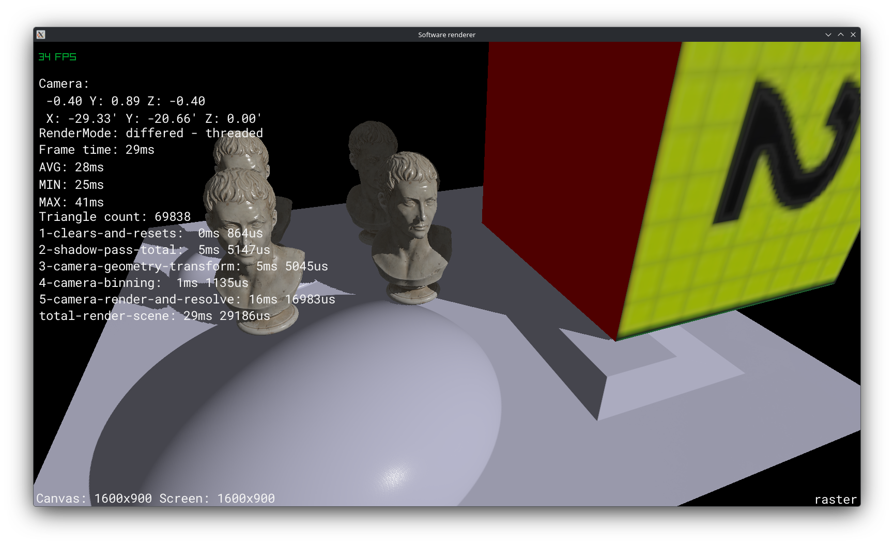
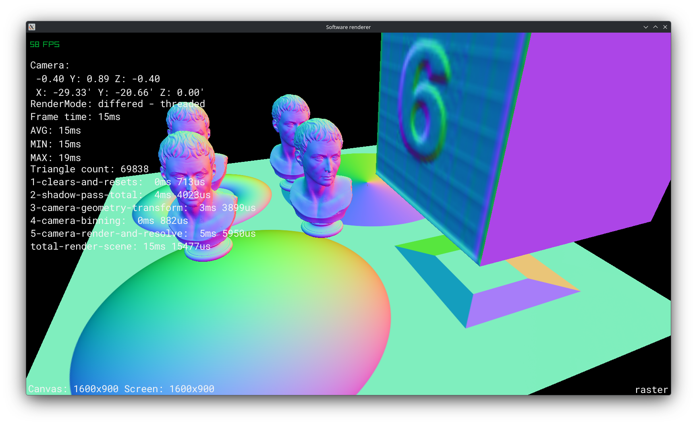
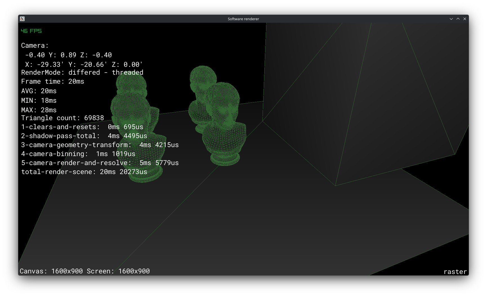
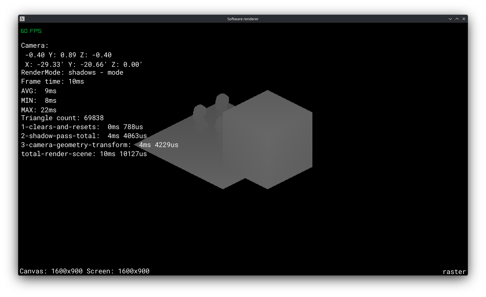
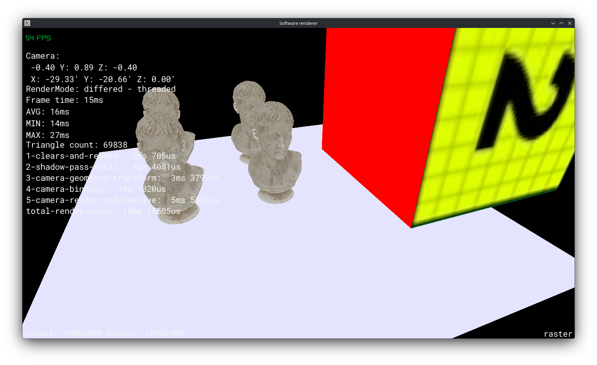

# raster-cpp

A high-performance, multithreaded, tile-based software rasterizer written from scratch in modern **C++23**. 

**raster-cpp** renders 3D scenes entirely on the CPU without relying on graphics APIs (Vulkan, DirectX, or OpenGL) for rasterization. It features a coarse-rasterization tile binning architecture, deferred and forward rendering paths, a physically based rendering (PBR) shading pipeline with normal mapping, directional shadow mapping, and real-time stage profiling telemetry.

[Raylib](https://www.raylib.com/) is used solely as a lightweight presentation layer to blit the final CPU framebuffer to the window and capture user input.

---

## Visual Showcase

| Lit PBR + Shadow Mapping | Active Tiles / Coarse Binning |
| :---: | :---: |
|  |  |
| **Normal Vector & Normal Map Pass** | **Wireframe Overlay** |
|  |  |
| **Directional Shadow Map Depth Buffer** | **Unlit / Albedo Mode** |
|  |  |

---

## Key Features

### High-Performance Tile-Based Architecture
- **Tiled Multithreading (`16x16` Tiles)**: The screen viewport is partitioned into uniform $16 \times 16$ pixel tiles. Work is dynamically distributed across worker threads (`std::jthread`) using lock-free atomic work-stealing (`alignas(64) std::atomic<int> tile_index`) to eliminate cache thrashing and false sharing.
- **Coarse Rasterization & Tile Binning**: Prior to fine rasterization, triangles are binned into relevant tiles using 2D screen-space axis-aligned bounding boxes (AABBs) and edge-function evaluations across tile corners, avoiding wasted work on empty screen regions.
- **Tiled Shadow Map Generation**: Directional shadow maps ($1024 \times 1024$) are also rendered multithreaded using coarse $32 \times 32$ tile binning.

### Rendering Pipelines
- **Tiled Deferred Shading (`DEFERRED_TILED_M`)**: Resolves scene geometry into a lightweight per-tile G-Buffer (`depth`, `triangle_id`, `uv`, `normal`) before executing a unified lighting pass.
- **Tiled Forward Shading (`FORWARD_TILED_M`)**: Evaluates lighting directly during the rasterization loop.
- **Shadow Map Visualizer (`SHADOW_MAPPING`)**: Direct debug projection of the directional light depth buffer.

### Shading & Material Pipeline
- **Physically Based Rendering (PBR)**:
  - **Cook-Torrance Microfacet Specular BRDF**
  - **Normal Distribution**: GGX / Trowbridge-Reitz
  - **Geometric Shadowing & Masking**: Smith model with Schlick-GGX visibility factor
  - **Fresnel Factor**: Schlick approximation
- **Tangent-Space Normal Mapping**: Tangent frame derivation with Gram-Schmidt orthogonalization for detailed surface micro-geometry.
- **Material Maps**: Diffuse / Albedo (`map_Kd`), Normal maps (`map_Bump`), Roughness maps (`map_Pr` / `map_Ns`), and specular coefficient support.
- **Directional Shadow Mapping**: Perspective and orthographic shadow map projections with near-plane clipping and depth comparison bias.

### Geometry & Clipping
- **Sutherland–Hodgman Near-Plane Polygon Clipping**: Robust camera near-plane and shadow-frustum polygon clipping in view space.
- **Culling Optimizations**:
  - View-space backface culling (`normal · -view_vertex <= 0`).
  - Screen-space boundary and NDC culling.
- **Perspective-Correct Interpolation**: Sub-pixel barycentric interpolation for $1/w$, depth, UV coordinates, normals, and tangents.

### Real-Time Profiling & Telemetry
- Microsecond-precision stage timer breakdown rendered live on screen:
  - `1-clears-and-resets`
  - `2-shadow-pass-total`
  - `3-camera-geometry-transform`
  - `4-camera-binning`
  - `5-camera-render-and-resolve`
  - `total-render-scene`
- Real-time FPS, instantaneous frame time, min/max/average frame times, and total triangle count (achieving ~30–60 FPS on scenes with ~70,000 triangles on modern CPUs).

---

## Interactive Controls

### Camera Controls (6-DOF)
| Key | Action |
| :--- | :--- |
| `W` / `S` | Move Forward / Backward |
| `A` / `D` | Move Left / Right (Strafe) |
| `Space` / `Left Ctrl` | Move Up / Down |
| `Mouse Move` | Free-look (Yaw / Pitch) |
| `Tab` | Toggle Mouse Cursor Lock (View Lock) |

### Renderer & Debug Modes
| Key | Action |
| :--- | :--- |
| `F` | Cycle Render Mode (`Deferred Tiled`, `Forward Tiled`, `Shadows Mode`) |
| `L` | Toggle Lighting (`Lit PBR` vs `Unlit Albedo`) |
| `N` | Toggle Normal Buffer Visualization |
| `Z` | Toggle Depth Buffer Visualization |
| `X` | Toggle Wireframe Mesh Overlay |
| `C` | Toggle Active Tiles Debug Grid |
| `T` | Toggle Triangle 2D Bounding Boxes (AABB) |
| `R` | Cycle Shadow Light Index |

---

## Project Structure

```
raster-cpp/
├── assets/                     # 3D models (.obj/.mtl), textures (.png), fonts
│   ├── polyhaven_rico_b3d/     # High-poly marble bust model & PBR textures
│   ├── sample_normal/          # Normal mapped sample meshes
│   ├── cube.obj                # Textured test cube
│   └── fonts/                  # RobotoMono font for the telemetry HUD
├── docs/
│   └── screenshots/            # Screenshots & render captures
├── include/
│   ├── camera/                 # Camera, view matrices, frustum
│   ├── colliders/              # AABB 2D/3D & sphere bounding volumes
│   ├── engine/                 # Renderer, Viewport, G-Buffer, Screen Tiles, Shaders
│   ├── lights/                 # Directional lights, shadow maps
│   ├── material/               # Textures, material definitions, color conversion
│   ├── model/                  # Meshes, triangles, vertex attributes
│   └── transforms/             # Vector & matrix math, transformation helpers
├── src/                        # Implementation files
│   ├── engine/renderer.cpp     # Tiled rasterization, binning, threading
│   ├── engine/shader.cpp       # Cook-Torrance PBR BRDF implementations
│   └── main.cpp                # Application entry point, render loop & HUD
└── CMakeLists.txt              # CMake build configuration (C++23)
```

---

## Building and Running

### Prerequisites
- **C++23 compliant compiler**: GCC 13+, Clang 16+, or MSVC 2022+
- **CMake**: Version 3.25 or higher
- **Git** (for automated FetchContent dependencies)
- System dependencies for Raylib (e.g. X11 / OpenGL dev packages on Linux):
  ```bash
  # Debian / Ubuntu / Pop!_OS
  sudo apt-get install libasound2-dev libx11-dev libxrandr-dev libxi-dev \
                       libxcursor-dev libxinerama-dev libgl1-mesa-dev
  ```

### Build Instructions

```bash
# 1. Clone the repository
git clone https://github.com/alvinobarboza/raster-cpp.git
cd raster-cpp

# 2. Configure the project with CMake
cmake -B build -DCMAKE_BUILD_TYPE=Release

# 3. Build the executable
cmake --build build --config Release -j$(nproc)

# 4. Run the renderer
cd build
./raster-cpp
```

*Note: Build in **Release** mode (`-O3`) for optimal software rasterization performance.*

---

## License

Assets from [Poly Haven](https://polyhaven.com/) are distributed under CC0.
